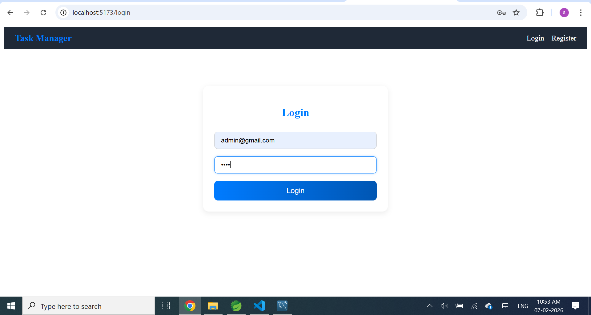
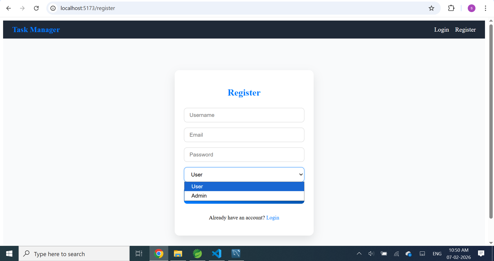
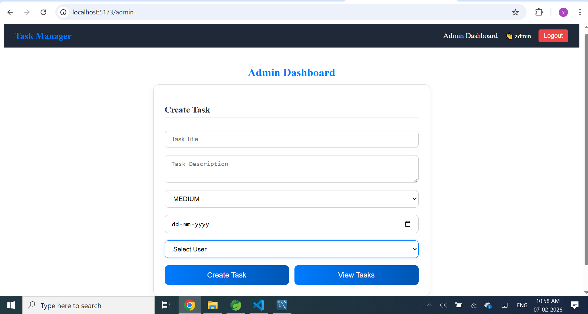
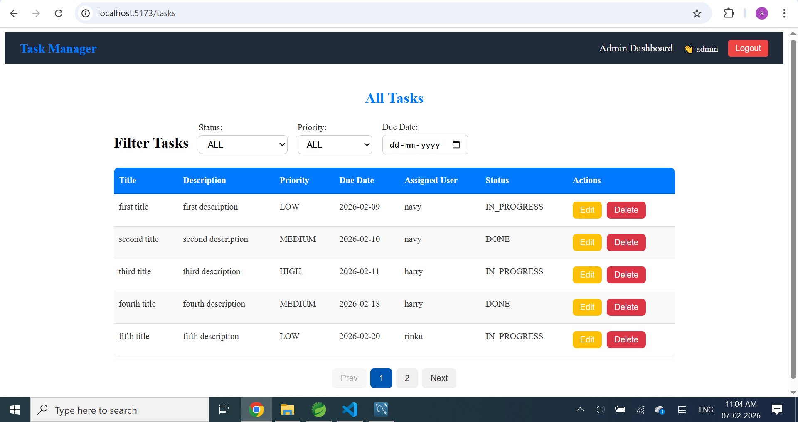
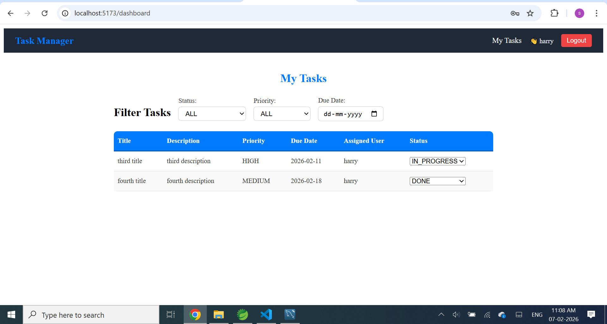
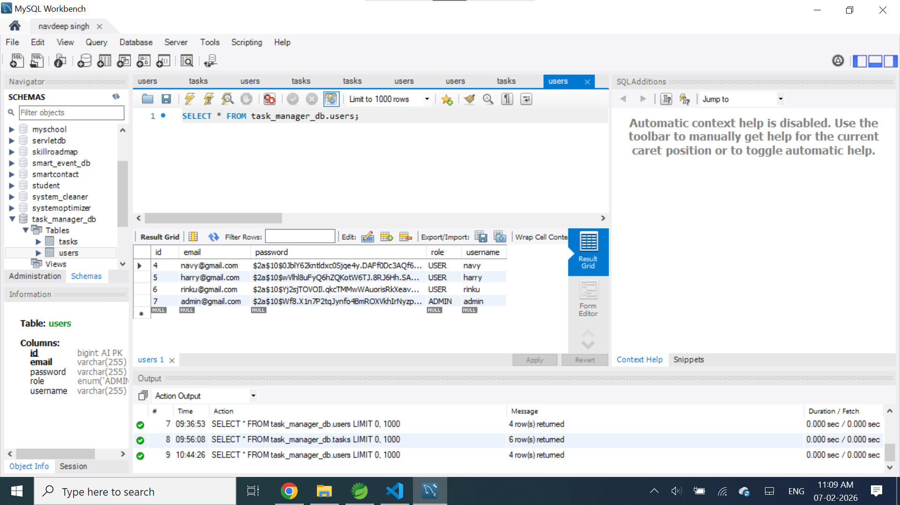
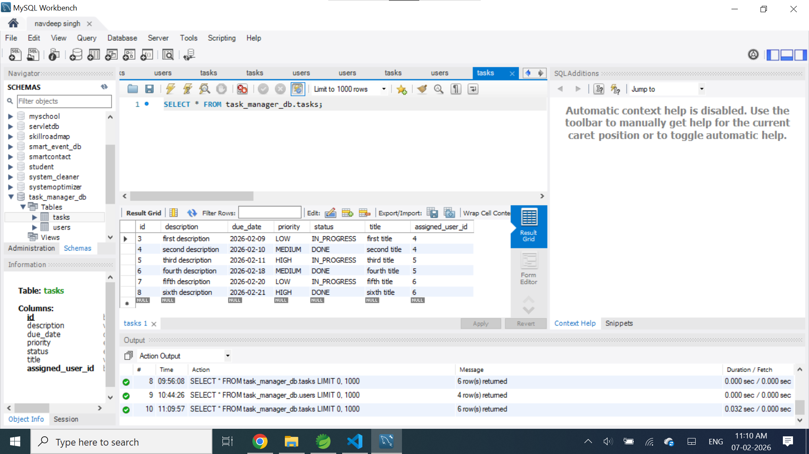

# Task Management System:
A full-stack Task Management System built with **Java Spring Boot, MySQL, and React**. Users can manage tasks with role-based access (ADMIN and USER), assign tasks, update task status, filter tasks, and more.

## User Module:
- Register & Login (JWT-based authentication)
- Roles: ADMIN and USER
- Role-based access:
  - Only **ADMIN** can create, edit, or delete tasks
  - Users can **view tasks assigned to them**
  - Users can **update only the task status** (TODO, IN_PROGRESS, DONE)
  - Admin dashboard shows tasks with default **TODO** status; status updates automatically 
    when users update it

## Task Module:
- CRUD operations (**ADMIN only**)
- Task properties:
  - Title
  - Description
  - Priority (LOW / MEDIUM / HIGH)
  - Status (TODO / IN_PROGRESS / DONE)
  - Due Date
  - Assigned User
- Filter tasks by Status, Priority, and Due Date
- Pagination
- Update task status via dropdown (**Users only**)

## Backend (Spring Boot + JPA + MySQL)
- REST APIs for tasks and users
- DTO + Mapper layer
- Global Exception Handling
- Role-based access implemented in controllers

## Frontend (React + Vite)
- Login / Register pages
- User dashboard with task list
- Admin dashboard with task creation form
- Create / Edit tasks (**ADMIN only**)
- Update task status (**Users only**)
- Role-based UI

## Tech Stack
- **Backend:** Java, Spring Boot, Spring Security, JPA, MySQL  
- **Frontend:** React, Vite, Axios, React-Router  
- **Authentication:** JWT  
- **Styling:** CSS Modules  
- **Build Tools:** Spring Starter Project (backend), Vite (frontend)

## Setup Instructions

### Prerequisites
- Java 17
- Maven
- Node.js v20
- MySQL

## Backend Setup:
- Backend will run on http://localhost:8080.
- Start Using Spring Boot App
 
## Frontend Setup: 
- cd D:\Task_Mangement_System\task-management-frontend
- npm install 
- npm run dev 
- Frontend will run on http://localhost:5173"

## Screenshots

### Login Page

### Register Page

### Admin Dashboard Form

### Admin View Tasks

### First User Dashboard

### Second User Dashboard

### Database - Role Based

### Database - Tasks
